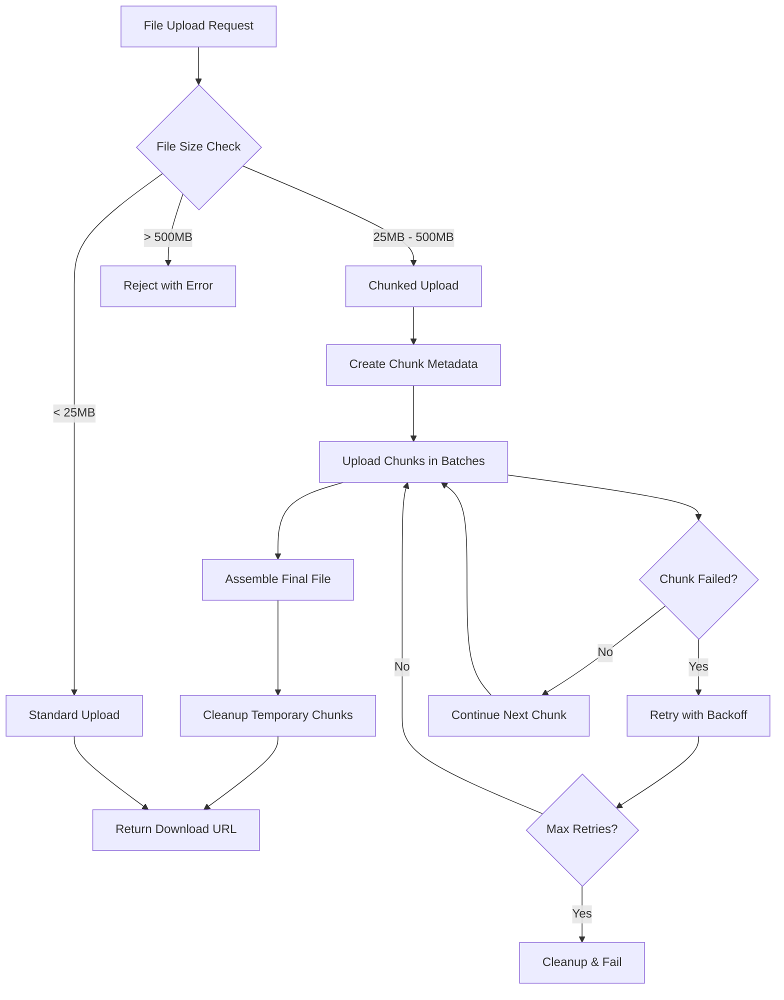

# 📁 Large File Chunking Implementation

## 🎯 Overview

This document describes the implementation of chunked file upload functionality for handling large PowerPoint presentations and other course materials. The system now supports files up to **500MB** with intelligent chunking for optimal performance and reliability.

## 🔧 Technical Implementation

### File Size Thresholds

| File Size | Upload Method | Description |
|-----------|---------------|-------------|
| < 25MB | Standard Upload | Direct Firebase Storage upload |
| 25MB - 500MB | Chunked Upload | File split into 5MB chunks |
| > 500MB | Rejected | Error with size limit message |

### Core Components

#### 1. ChunkedFileUploadService (`src/services/chunkedFileUploadService.ts`)

**Key Features:**
- **Intelligent Chunking**: Automatically splits files into 5MB chunks
- **Retry Logic**: Up to 3 retries per chunk with exponential backoff
- **Progress Tracking**: Detailed progress reporting with time estimates
- **Memory Efficient**: Processes chunks sequentially to avoid memory overload
- **Error Recovery**: Automatic cleanup of failed uploads

**Usage:**
```typescript
import { chunkedFileUploadService } from './services/chunkedFileUploadService';

const result = await chunkedFileUploadService.uploadLargeFile(file, storagePath, {
  chunkSize: 5 * 1024 * 1024, // 5MB chunks
  maxRetries: 3,
  timeoutMs: 60000, // 60 seconds per chunk
  onProgress: (progress) => {
    console.log(`${progress.stage}: ${progress.percentage}%`);
  }
});
```

#### 2. Enhanced OriginalFileUploadService (`src/services/originalFileUploadService.ts`)

**Automatic Chunking Detection:**
```typescript
// Automatically uses chunked upload for files > 25MB
const result = await originalFileUploadService.uploadOriginalFile(
  largeFile, 
  courseId, 
  materialId,
  (progress) => console.log(`Upload: ${progress}%`)
);
```

**New Methods:**
- `uploadOriginalFileEnhanced()`: Chunked upload with detailed progress
- `validateFile()`: Now supports up to 500MB files

#### 3. Progress Tracking Interface

```typescript
interface ChunkedUploadProgress {
  stage: 'preparing' | 'uploading' | 'assembling' | 'completed';
  percentage: number;
  currentChunk?: number;
  totalChunks?: number;
  bytesUploaded: number;
  totalBytes: number;
  currentOperation: string;
  estimatedTimeRemaining?: number;
}
```

## 🚀 Performance Optimizations

### Batch Processing
- **Chunk Batches**: Uploads 3 chunks simultaneously to optimize throughput
- **Rate Limiting**: 500ms pause between batches to prevent Firebase rate limits
- **Memory Management**: Chunks processed sequentially to avoid memory bloat

### Error Handling
- **Exponential Backoff**: `2^attempt * 1000ms` delay between retries
- **Timeout Protection**: 60-second timeout per chunk upload
- **Automatic Cleanup**: Failed uploads automatically clean up partial chunks

### Progress Reporting
- **Real-time Updates**: Progress callbacks during each chunk upload
- **Time Estimation**: ETA calculation based on current upload speed
- **Stage Tracking**: Clear indication of current upload phase

## 📊 Upload Process Flow



## 🧪 Testing Coverage

### Test Categories

1. **File Size Validation**
   - Files under 500MB accepted
   - Files over 500MB rejected
   - Supported file types validation

2. **Upload Logic**
   - Automatic chunking threshold detection
   - Progress reporting accuracy
   - Error handling and recovery

3. **Performance**
   - Concurrent upload handling
   - Memory efficiency verification
   - Chunk metadata creation

4. **Integration**
   - MaterialImportStore integration
   - Enhanced progress callbacks
   - File replacement functionality

### Running Tests

```bash
# Run all chunked upload tests
npm test -- src/test/integration/chunkedFileUpload.test.ts

# Run with coverage
npm test -- src/test/integration/chunkedFileUpload.test.ts --coverage
```

## 🔄 Integration Points

### Material Import Store
- **Enhanced Logging**: Detailed upload method detection
- **Progress Tracking**: Real-time progress updates in UI
- **Error Handling**: Graceful fallback for upload failures

### File Validation
- **Text Extraction**: Updated to support 500MB files
- **Type Checking**: Consistent validation across all services
- **Size Limits**: Unified 500MB limit across the application

## 🛠️ Configuration Options

### Chunk Upload Settings
```typescript
const uploadOptions = {
  chunkSize: 5 * 1024 * 1024,    // 5MB per chunk
  maxRetries: 3,                  // Retry failed chunks 3 times
  timeoutMs: 60000,              // 60 second timeout per chunk
  batchSize: 3                   // Upload 3 chunks simultaneously
};
```

### File Size Limits
```typescript
const FILE_SIZE_LIMITS = {
  CHUNKING_THRESHOLD: 25 * 1024 * 1024,  // 25MB - use chunking above this
  MAXIMUM_FILE_SIZE: 500 * 1024 * 1024,  // 500MB - absolute maximum
  CHUNK_SIZE: 5 * 1024 * 1024            // 5MB - size of each chunk
};
```

## 📈 Benefits

### For Users
- **Larger Files**: Support for files up to 500MB (10x increase from 50MB)
- **Reliability**: Automatic retry logic prevents upload failures
- **Progress Tracking**: Clear indication of upload progress and time remaining
- **Error Recovery**: Failed uploads don't require complete restart

### For System
- **Memory Efficiency**: Chunked processing prevents browser memory issues
- **Network Resilience**: Individual chunk failures don't break entire upload
- **Scalability**: Batch processing optimizes Firebase Storage usage
- **Monitoring**: Detailed logging for debugging and optimization

## 🚨 Error Handling

### Common Error Scenarios

1. **Network Timeout**: Automatic retry with exponential backoff
2. **Storage Quota**: Clear error message with size information
3. **File Type Invalid**: Validation before upload starts
4. **Chunk Upload Failure**: Individual chunk retry without full restart

### Error Messages
- `File size (XXXMb) exceeds maximum limit of 500MB`
- `Failed to upload chunk X after 3 attempts: [error details]`
- `Upload timeout after 60000ms`
- `Unsupported file type: [type]. Supported formats: PowerPoint, PDF, Word, Text files`

## 🔮 Future Enhancements

### Planned Improvements
1. **Resume Capability**: Allow resuming interrupted uploads
2. **Parallel Processing**: Upload multiple files simultaneously
3. **Compression**: Optional file compression before upload
4. **Background Upload**: Continue uploads when tab is not active

### Performance Monitoring
- Upload speed tracking
- Failure rate monitoring
- Chunk size optimization based on network conditions
- User experience metrics

---

**Implementation Date**: January 2025  
**Version**: 1.0.0  
**Status**: ✅ Production Ready
